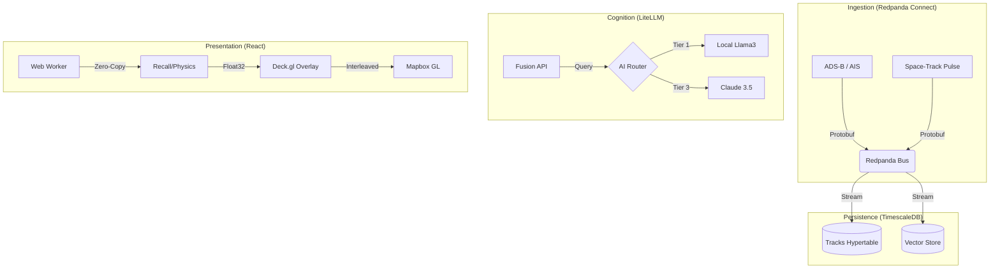

# Sovereign Watch: Distributed Multi-INT Fusion Center

> **Operational Status**: Phase 1 (Infrastructure & Foundation) - _Active Development_

Sovereign Watch is a self-hosted, distributed intelligence fusion platform designed to ingest, normalize, and analyze high-velocity telemetry (ADS-B, AIS, Orbital) and high-variety intelligence (SIGINT, OSINT). It enforces data sovereignty by running entirely on local hardware (Edge to Cloud), utilizing a "Pulse" architecture for data collection and a "Tiered AI" strategy for cognition.

---

## 🛠️ Quick Start

### Prerequisites

- Docker & Docker Compose
- NVIDIA Container Toolkit (if using Local AI/Jetson)

### Installation

1.  **Clone & Configure**:

    ```bash
    cp .env.example .env
    # Edit .env with your keys (Airplanes.live, Mapbox, etc.)
    ```

2.  **Boot System**:

    ```bash
    docker compose up -d
    ```

3.  **Access Interfaces**:
    - **Tactical Map (UI)**: [http://localhost:3000](http://localhost:3000)
    - **Fusion API**: [http://localhost:8000/docs](http://localhost:8000/docs)
    - **Redpanda Console**: [http://localhost:8080](http://localhost:8080)
    - **Portainer**: [http://localhost:9000](http://localhost:9000)

## 📂 Architecture Overview



## 🏗️ Directory Structure

| Path                 | Purpose                                                 |
| :------------------- | :------------------------------------------------------ |
| `/.agent`            | Agent memory, skills, and workflows (DO NOT DELETE).    |
| `/backend/ingestion` | Redpanda Connect (Benthos) pipeline configs (`.yaml`).  |
| `/backend/db`        | Database schema (`init.sql`) and migration scripts.     |
| `/backend/api`       | Python FastAPI service for Fusion and Analysis.         |
| `/frontend`          | React + Vite application (Tactical Map).                |
| `/docs`              | Architecture plans, research papers, and progress logs. |

## 🧪 Development Workflow

To add a new dependency (e.g., to Frontend):

1.  **Edit** `frontend/package.json`.
2.  **Rebuild**:
    ```bash
    docker compose up -d --build frontend
    ```

To update the Database Schema:

1.  **Edit** `backend/db/init.sql`.
2.  **Reset** (Warning: Destructive):
    ```bash
    docker compose down -v
    docker compose up -d db
    ```

---

_Maintained by d3FRAG Networks & The Antigravity Agent Team._
