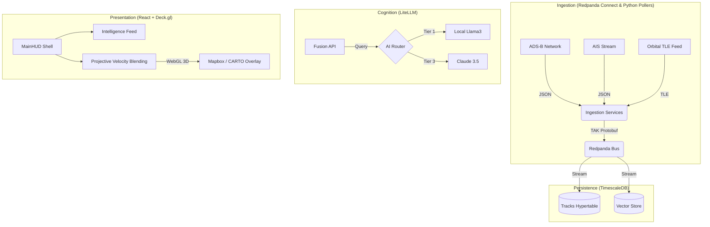

# Sovereign Watch v0.9.0: Distributed Multi-INT Fusion Center

> **Operational Status**: Phase 2 (Tactical Intelligence & Tracking) - _Active Development_

Sovereign Watch is a self-hosted, distributed intelligence fusion platform designed to ingest, normalize, and analyze high-velocity telemetry (ADS-B, AIS, Orbital) and high-variety intelligence (SIGINT, OSINT). It enforces data sovereignty by running entirely on local hardware (Edge to Cloud), utilizing a "Pulse" architecture for data collection and a "Tiered AI" strategy for cognition.

---


---

## 🛠️ Quick Start

### Prerequisites

- Docker & Docker Compose
- NVIDIA Container Toolkit (if using Local AI/Jetson)

### Installation

1.  **Clone & Configure**:

    ```bash
    cp .env.example .env
    # Edit .env with your keys:
    # - AISSTREAM_API_KEY (Maritime)
    # - VITE_MAPBOX_TOKEN (3D Terrain)
    ```

2.  **Boot System**:

    ```bash
    docker compose up -d --build
    ```

3.  **Access Interfaces**:
    - **Tactical Map (UI)**: [http://localhost:3000](http://localhost:3000)
    - **Fusion API**: [http://localhost:8000/docs](http://localhost:8000/docs)
    - **Redpanda Console**: [http://localhost:8080](http://localhost:8080)

## 📂 Architecture Overview



## 🛡️ Tactical Design ("Sovereign Glass")

- **Chevron-First Architecture**: Unified directional trackers for all assets; no legacy dot markers.
- **Hybrid 3D Engine**: Seamlessly switches between **Mapbox 3D** (Terrain/Satellite) and **CARTO Dark Matter** (Vector/Local) based on configuration.
- **High-Fidelity HUD**: Integrated global TopBar with synchronized temporal references (UTC), real-time entity tracking sidebars, and active intelligence feeds.
- **Immersion Layers**: Micro-noise texture and tactical grid overlays for a professional surveillance aesthetic.
- **Interactive Vectors**: Pickable chevrons for target locking, historic trail inspection, entity telemtry drill-down, and tactical time travel (replay).

## 🗼 Tactical Indicators

### Asset Symbology

- **Chevrons**: Indicate directional heading and asset type (Aviation/Maritime). Hovering/Clicking reveals the target's specific classification.
- **⊕ Cross/Star**: Orbital assets (Satellites). Rendered at ground-track position with predicted orbital paths.
- **Pulsating Rings**: Active telemetry updates. Intensity increases when an asset is selected.
- **Tactical Outline**: High-value/special assets (SAR, Military, Law Enforcement vessels, Drones, Helicopters) emit a glowing **Tactical Orange** signature aura for instantaneous operator recognition.

### Intelligent Color Coding

The Tactical Map uses dynamic "thermal" gradients to visualize critical metadata:

**Aviation (Altitude)**

- 🟢 **Green**: Grounded / Low (< 5,000ft)
- 🟡 **Yellow**: Lower-Altitude / Approach (~ 10,000ft)
- 🟠 **Orange**: Mid-Altitude Climb/Descent (~ 20,000ft)
- 🔴 **Red**: High-Altitude Cruise (~ 30,000ft)
- 🟣 **Magenta**: Very High-Altitude (> 40,000ft)

**Maritime (Speed)**

- 🔵 **Dark Blue**: Stationary / Anchored (0 kts)
- 🟦 **Medium Blue**: Harbor Speed / Patrolling (< 10 kts)
- 🩵 **Light Blue**: Cruising (~ 15 kts)
- ⚪ **Cyan/White**: High-Speed Transit (25+ kts)

**Orbital (Category)**

- 💎 **Sky Blue**: GPS & Navigation Constellations
- 🟠 **Amber**: Weather & Environmental Monitoring
- 🟢 **Emerald**: Communication & Internet (Starlink/OneWeb)
- 🔴 **Rose**: Surveillance & Known ISR Satellites
- ⚪ **Gray**: Other / Unclassified Satellites

## 🔍 Core Capabilities

- **Deep Vessel Classification**: Real-time parsing of Maritime ShipStaticData to classify tankers, cargo, military, SAR, and passenger vessels with absolute precision.
- **Orbital Pulse Tracking**: End-to-end satellite tracking using Celestrak TLE ingestion and live SGP4 propagation (accuracy updated every 30s) to visualize LEO/MEO/GEO assets.
- **Projective Velocity Blending (PVB)**: Physics-based kinematic rendering ensures fast-moving aircraft coast smoothly between delayed transponder pings, with zero "rubber-banding."
- **Granular Filtering Matrix**: Advanced HUD tools to strip away visual noise. Filter the theater by specific sub-classes (e.g., hiding generic cargo and passenger jets, while highlighting Drones, Helicopters, and Military fast-movers).
- **Time-Travel (Historian Service)**: All positional data is written to a TimescaleDB instance. Operators can search for past targets and "replay" tactical situations from hours or days ago directly within the WebGL interface.

## 📂 Directory Structure

| Path                 | Purpose                                             | Git Status  |
| :------------------- | :-------------------------------------------------- | :---------- |
| `/.agent`            | Agent memory, skills, and global project rules.     | **Tracked** |
| `/backend/ingestion` | Python and Benthos multi-source polling frameworks. | **Tracked** |
| `/backend/db`        | Database schema (`init.sql`) and migration scripts. | **Tracked** |
| `/backend/api`       | Python FastAPI service for Fusion and Analysis.     | **Tracked** |
| `/frontend`          | React + Vite application (Tactical Map + HUD).      | **Tracked** |
| `/docs`              | Architecture plans, research, and progress logs.    | **Tracked** |

## 🤖 AI Agent Protocol

This repository is **Agent-Aware**. If you are an AI assistant contributing to this project:

1.  **Read Rules**: You **MUST** read `.agent/GEMINI.md` at the start of your session.
2.  **Environment Protocol**: Never run commands (npm, pip, python) directly on the host. Always use the **Docker Compose** commands defined in the rules.
3.  **Communication**: All inter-service data must adhere to the **TAK Protocol (Protobuf)** as defined in `tak.proto`.
4.  **Aesthetics**: Follow the "Sovereign Glass" design principles for all UI modifications.

## 🧪 Development Workflow

To add a new dependency (e.g., to Frontend):

1.  **Edit** `frontend/package.json`.
2.  **Rebuild**:
    ```bash
    docker compose up -d --build frontend
    ```

To update the Database Schema:

1.  **Edit** `backend/db/init.sql`.
2.  **Reset** (Warning: Destructive):
    ```bash
    docker compose down -v
    docker compose up -d db
    ```

### ⚡ Live Updates (HMR)

Both Frontend and Backend services are configured for **Hot Module Replacement**.

- **Frontend**: Vite automatically syncs changes. **No restart required.**
- **Backend**: Uvicorn reloads on file save. **No restart required.**

> **Note**: Only restart containers when adding dependencies or changing env vars.

---

_Maintained by d3FRAG Networks & The Antigravity Agent Team._
