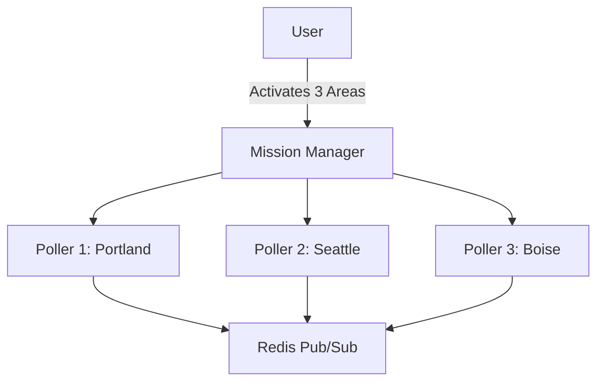

# Dynamic Area Management - Future Enhancements

## Completed Features ✅

- ✅ Right-click context menu for map interaction
- ✅ Dynamic area pivoting via API
- ✅ Mission presets (30-300nm)
- ✅ LocalStorage persistence
- ✅ Mission Navigator widget
- ✅ Real-time poller updates via Redis pub/sub

---

## Phase 4: Advanced Visualization & UX

### 1. **Dynamic Polling Coverage Visualization** 🎯 HIGH PRIORITY

**Problem**: Currently no visual indicator of ACTUAL polling coverage
**Solution**: Replace static circles with live H3 cell visualization

**Implementation**:

```typescript
// Show actual H3 cells being polled
const PollingCoverageLayer = () => {
  const [activeCells, setActiveCells] = useState<string[]>([]);

  useEffect(() => {
    // Subscribe to poller updates via WebSocket or polling
    const ws = new WebSocket('ws://localhost:8000/ws/polling-coverage');
    ws.onmessage = (e) => {
      const { h3_cells } = JSON.parse(e.data);
      setActiveCells(h3_cells);
    };
  }, []);

  return <H3HexagonLayer cells={activeCells} color="#00ff4130" />;
};
```

**Benefits**:

- Users see EXACTLY where data is being collected
- Visual confirmation of area pivoting
- Helps debug coverage gaps

**Effort**: ~2-3 hours

---

### 2. **Mission Area Labels & Metadata**

Display mission name and metadata on the map

**Features**:

- Floating label at center of coverage area
- Shows: Mission name, radius, last updated
- Tooltip shows full mission details
- Multiple missions: stacked labels with z-index

**Mockup**:

```
┌─────────────────────┐
│  🏙️ Metro Seattle   │
│  Radius: 100nm      │
│  Updated: 2m ago    │
└─────────────────────┘
```

**Effort**: ~1 hour

---

### 3. **Historical Mission Replay**

Visualize past mission area changes over time

**Features**:

- Timeline slider showing all mission changes
- Replay button to animate area transitions
- Export mission history as JSON
- Compare multiple time periods

**Use Cases**:

- Operational review
- Training scenarios
- Coverage analysis

**Effort**: ~4-5 hours

---

### 4. **Share Mission Areas via URL**

Generate shareable links for mission configurations

**Implementation**:

```typescript
// Generate shareable URL
const shareUrl = `https://sovereign.watch/mission/${btoa(JSON.stringify(mission))}`;

// Parse on load
useEffect(() => {
  const urlParams = new URLSearchParams(window.location.search);
  const missionData = urlParams.get("mission");
  if (missionData) {
    const mission = JSON.parse(atob(missionData));
    loadMission(mission);
  }
}, []);
```

**Benefits**:

- Team collaboration
- Incident briefings
- Remote mission planning

**Effort**: ~2 hours

---

### 5. **Export/Import Mission Configurations**

Backup and restore mission libraries

**Features**:

- Export all saved missions as `.json`
- Import missions from file
- Merge or replace existing missions
- Version compatibility checks

**Format**:

```json
{
  "version": "1.0",
  "exported_at": "2026-02-04T20:45:00Z",
  "missions": [
    {
      "id": "mission-123",
      "name": "Port Seattle Coverage",
      "lat": 47.6062,
      "lon": -122.3321,
      "radius_nm": 50,
      "created_at": "2026-02-01T10:00:00Z"
    }
  ]
}
```

**Effort**: ~1.5 hours

---

### 6. **Multi-Area Monitoring**

Monitor multiple areas simultaneously

**Features**:

- Add up to 5 concurrent mission areas
- Each area gets its own poller instance
- Color-coded coverage circles
- Toggle areas on/off
- Resource usage monitoring

**Architecture**:



**Constraints**:

- Max 5 concurrent areas (resource limits)
- Each poller gets proportional CPU allocation
- Warning if total coverage > 1000nm radius

**Effort**: ~6-8 hours (requires backend refactor)

---

### 7. **Smart Mission Recommendations**

AI-powered mission area suggestions

**Use Cases**:

- "Cover all major airports in WA state"
- "Monitor shipping lanes between Seattle and Vancouver"
- "Track aircraft departing SFO"

**Implementation**:

- LLM integration for natural language queries
- Pre-computed mission templates
- Geospatial reasoning (airports, ports, borders)

**Effort**: ~10+ hours

---

### 8. **Mobile-Optimized Mission Control**

Touch-friendly interface for tablets

**Features**:

- Long-press instead of right-click
- Swipe gestures for mission switching
- Simplified UI for smaller screens
- Offline mission library sync

**Effort**: ~5-6 hours

---

### 9. **Mission Analytics Dashboard**

Visualize operational metrics

**Metrics**:

- Most frequently used mission areas
- Average dwell time per mission
- Coverage efficiency (entities captured vs area size)
- Historical heatmap of focus areas

**Charts**:

- Mission usage over time (line chart)
- Radius distribution (histogram)
- Geographic heatmap of all saved missions

**Effort**: ~4 hours

---

### 10. **Collaborative Mission Planning**

Multi-user mission area coordination

**Features**:

- Share active mission in real-time
- See other operators' coverage areas
- Lock/unlock missions
- Chat annotations on map

**Tech Stack**:

- WebSocket for real-time sync
- Operational Transform (OT) for conflict resolution
- TimescaleDB for mission history

**Effort**: ~15+ hours (complex feature)

---

## Quick Wins (< 2 hours each)

- [x] Mission presets with icons
- [ ] Keyboard shortcuts (Ctrl+M for mission menu)
- [ ] Recent missions dropdown (last 5)
- [ ] Mission area name search/filter
- [ ] One-click "Follow Aircraft" mode
- [ ] Mission area color customization
- [ ] Distance ruler on coverage circle
- [ ] Center dot at mission focus point

---

## Performance Optimizations

### LocalStorage Cleanup

- Auto-delete missions older than 90 days
- Compress mission data with LZ-string
- Lazy-load mission list (virtualization)

### Polling Optimization

- Adaptive polling intervals based on entity density
- Reduce radius if >500 entities detected
- Smart caching of repeat areas

---

## Security Considerations

### Future DB Migration

When moving from LocalStorage → TimescaleDB:

- Encrypt mission coordinates
- Role-based access control (RBAC)
- Audit log for mission changes
- Rate limiting on mission creation

---

## Notes

- All enhancements assume Phase 1-3 foundation is stable
- Prioritize #1 (Polling Coverage Visualization) - critical UX gap
- Features 6, 7, 10 require significant backend work
- Mobile support (#8) may warrant separate React Native app

**Last Updated**: 2026-02-04
**Maintainer**: Sovereign Watch Development Team
