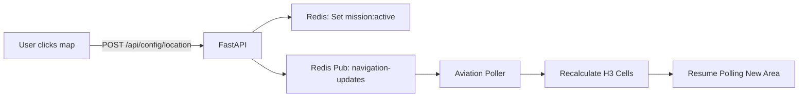

# Dynamic Area Management - Implementation Progress

## Phase 1: Backend Core ✅ COMPLETE

### What We Built:

1. **FastAPI Endpoints** (`backend/api/main.py`):
   - `POST /api/config/location` - Update surveillance area
   - `GET /api/config/location` - Retrieve current area
   - Redis pub/sub integration for real-time updates
   - Validation (10-300nm range, valid coordinates)

2. **Aviation Poller** (`backend/ingestion/poller/main.py`):
   - Added Redis connection and pub/sub listener
   - Dynamic mission area recalculation
   - Real-time polling point updates
   - Background task for navigation updates

### How It Works:



### Testing:

```bash
# Test updating mission area
curl -X POST http://localhost:8000/api/config/location \
  -H "Content-Type: application/json" \
  -d '{"lat": 34.05, "lon": -118.25, "radius_nm": 100}'

# Expected: Poller logs "📍 Mission area updated"
# Response: {"status": "ok", "active_mission": {...}}

# Verify current area
curl http://localhost:8000/api/config/location
```

## Phase 2: Frontend UI (Next)

### Components to Build:

1. **MapContextMenu.tsx**
   - Right-click handler with `preventDefault()`
   - Tactical context menu design
   - Options: "Set Focus Here", "Save Location", "Return Home"

2. **MissionNavigator.tsx**
   - Saved locations dropdown
   - Mission preset buttons (Airport, Metro, Coastal, etc.)
   - Radius slider

3. **LocalStorage Integration**
   - Save/load mission areas
   - Format: `[{id, name, lat, lon, radius_nm, created_at}]`

4. **Coverage Visualization**
   - Semi-transparent circle showing polling radius
   - Color: Cyan for aviation, Green for maritime
   - Pulsating border for "Active" state

### Estimated Time:

- Context Menu: ~30 minutes
- Navigator Widget: ~45 minutes
- Storage + State: ~30 minutes
- Coverage Overlay: ~20 minutes
  **Total: ~2 hours**

## Dependencies Deployed:

- `redis>=5.0.0` added to:
  - `backend/api/requirements.txt`
  - `backend/ingestion/poller/requirements.txt` (already present)

## What's Left:

- [ ] Frontend right-click context menu
- [ ] Frontend mission navigator widget
- [ ] Frontend localStorage persistence
- [ ] Frontend coverage circle visualization
- [ ] Testing end-to-end workflow
- [ ] Phase 2: Python maritime poller (future)
