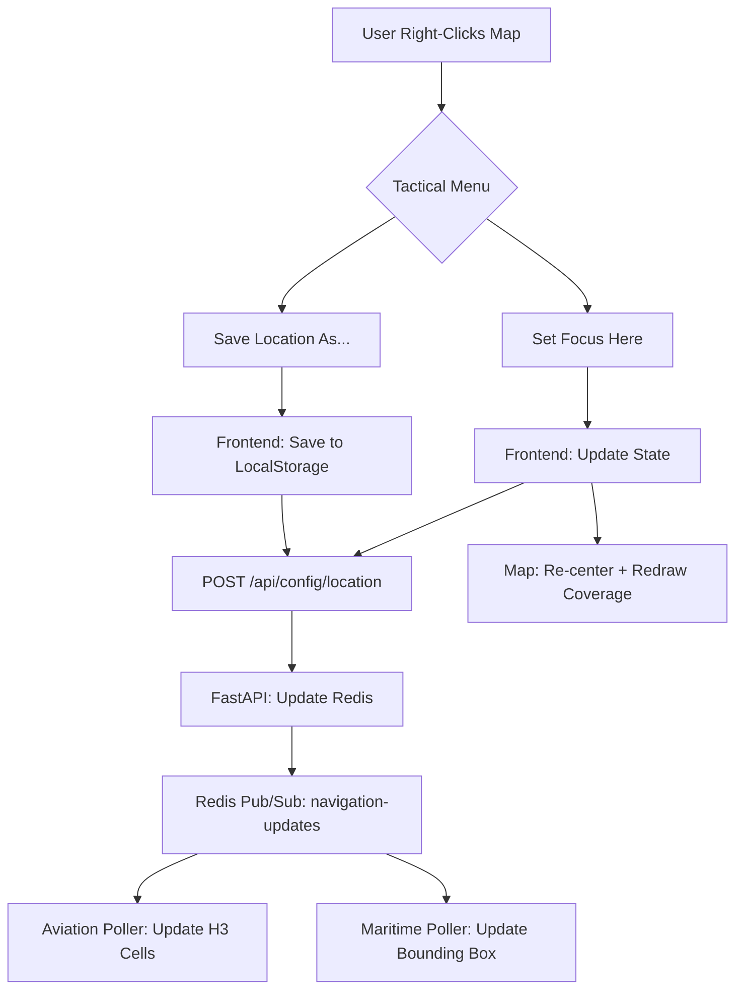

# TASK: Dynamic Area Management (DAM)

**Status**: Completed  
**Priority**: P1 (High - Core Feature Enhancement)  
**Type**: Feature Implementation  
**Created**: 2026-02-04

---

## 🎯 Objective

Transform Sovereign Watch from a static, environment-configured monitoring system into a **dynamic, user-controlled global reconnaissance platform**. Users should be able to:

- Interactively select mission areas on the tactical map
- Define custom polling radii for focused or broad coverage
- Save and switch between named mission areas (e.g., "Home Base", "Suez Canal", "Taiwan Strait")
- Have pollers automatically pivot to new coordinates without container restarts

---

## 🧭 User Story

> **As a tactical analyst**, I want to right-click anywhere on the map and designate that location as my new surveillance focus, so that I can rapidly respond to developing situations without needing to reconfigure Docker containers or restart services.

---

## 📋 Requirements

### Functional Requirements

1. **Map Interaction**:
   - Right-click on map to open tactical context menu
   - Context menu options:
     - 📍 "Set Focus Here" (immediate pivot)
     - 💾 "Save Location As..." (prompted for name + radius)
     - 🏠 "Return to Home" (revert to Docker ENV defaults)
2. **Mission Area Configuration**:
   - User specifies:
     - Center Coordinates (Lat/Lon)
     - Polling Radius (Nautical Miles, 10nm - 300nm)
     - Optional: Mission Name (default: "Untitled Mission")
3. **Saved Locations**:
   - Persistent storage of named mission areas
   - Quick-switch dropdown in UI
   - Edit/Delete functionality
4. **Live Ingestion Pivot**:
   - Aviation poller (`sovereign-adsb-poller`) must update H3 cells in real-time
   - Maritime ingestion (`sovereign-ais-benthos`) must update bounding box
   - UI map must re-center and redraw coverage boundaries

### Non-Functional Requirements

- **Performance**: Polling pivot must complete within 2 seconds
- **Rate Limiting**: Prevent users from setting excessive radii that trigger upstream API throttling
- **State Sync**: Map UI and backend pollers must remain synchronized

---

## 🏗️ Architecture Design

### Phase 1: LocalStorage Implementation (CURRENT PLAN)



**Storage Strategy (Phase 1)**:

- **Browser LocalStorage**: Store mission areas as JSON array
- **Format**: `[{ id, name, lat, lon, radius_nm, created_at }]`
- **Pros**: Fast implementation, no DB changes
- **Cons**: Per-device storage, vulnerable to cache clearing

**Future Migration (Phase 2 - Database)**:

- Create `mission_areas` table in TimescaleDB
- Add user authentication/multi-user support
- Enable team-shared mission area libraries
- Historical mission area analytics

---

## 🔧 Implementation Components

### 1. Backend API (`backend/api/main.py`)

**New Endpoints**:

```python
POST /api/config/location
  Body: { lat, lon, radius_nm }
  Response: { status: "ok", active_mission: {...} }

GET /api/config/location
  Response: { lat, lon, radius_nm, updated_at }
```

**Redis Schema**:

```
KEY: "mission:active"
VALUE: { lat, lon, radius_nm, updated_at }

PUBSUB: "navigation-updates"
PAYLOAD: { lat, lon, radius_nm }
```

---

### 2. Aviation Poller (`backend/ingestion/poller/main.py`)

**Enhancements**:

- Subscribe to Redis `navigation-updates` channel
- On message received:
  1. Cancel current polling cycle
  2. Recalculate H3 cells using new center/radius
  3. Clear stale entity cache
  4. Resume polling with new geometry

**Key Functions**:

```python
async def handle_navigation_update(message):
    """Pivot polling area to new coordinates"""
    new_center = (message['lat'], message['lon'])
    new_radius = message['radius_nm']

    # Recalculate H3 coverage
    self.h3_cells = get_coverage_cells(new_center, new_radius)

    # Reset poller state
    await self._reset_and_resume()
```

---

### 3. Maritime Poller (`backend/ingestion/maritime_ingest.yaml`)

**Challenge**: Benthos (Redpanda Connect) does not support dynamic config reloading.

**Solutions**:

- **Option A (Quick)**: Restart container via Docker API when config changes
- **Option B (Elegant)**: Migrate maritime ingestion to Python (matching aviation pattern)
- **Option C (Hybrid)**: Keep Benthos but add a sidecar watcher that rewrites config + triggers restart

**Decision**: Migrate to **Option B** as it is the most elegant and maintainable solution.

---

### 4. Frontend UI Components

#### **A. Tactical Context Menu** (`frontend/src/components/map/MapContextMenu.tsx`)

```tsx
<ContextMenu position={clickPosition}>
  <MenuItem icon={<Crosshair />} onClick={focusHere}>
    Set Focus Here
  </MenuItem>
  <MenuItem icon={<Save />} onClick={saveLocation}>
    Save Location As...
  </MenuItem>
  <MenuItem icon={<Home />} onClick={returnHome}>
    Return to Home Base
  </MenuItem>
</ContextMenu>
```

#### **B. Mission Navigator** (`frontend/src/components/widgets/MissionNavigator.tsx`)

```tsx
<Panel>
  <Select
    value={activeMission}
    onChange={switchMission}
    options={savedMissions}
  />
  <Button onClick={editMissions}>Manage Locations</Button>
</Panel>
```

#### **C. Coverage Overlay** (Updated in `TacticalMap.tsx`)

- Render semi-transparent circle showing active polling radius
- Color-coded by domain (Cyan for Aviation, Green for Maritime)
- Pulsating border to indicate "Live Polling Active"

---

## 📐 Design Decisions

### Decision 1: Storage Layer

- **Choice**: LocalStorage (Phase 1) → Database (Phase 2)
- **Rationale**: Rapid iteration, defer complexity until multi-user requirements emerge
- **Migration Path**: Export/import JSON, or bulk-insert into DB when migrating

### Decision 2: Right-Click Interaction

- **Choice**: Tactical Context Menu (not instant-focus)
- **Rationale**: More deliberate, professional UX; prevents accidental pivots

### Decision 3: Radius Constraints & Mission Presets

- **Min**: 10nm (airport-scale operations)
- **Max**: 300nm (continental/trans-oceanic monitoring)
- **Dynamic**: User-adjustable per mission area

**Smart Presets** (Guide users toward appropriate scales):

```typescript
const MISSION_PRESETS = {
  airport: { radius: 30, icon: "✈️", label: "Airport Ops" },
  metro: { radius: 100, icon: "🏙️", label: "Metro Area" },
  coastal: { radius: 150, icon: "🌊", label: "Coastal Region" },
  corridor: { radius: 250, icon: "🛤️", label: "Transit Corridor" },
  max: { radius: 300, icon: "🌐", label: "Maximum Range" },
};
```

**Coverage Guidance**:

- 30nm: Dense traffic, ideal for airport/port operations (20-100 entities)
- 100nm: Metropolitan airspace coverage (100-300 entities)
- 150nm: Coastal monitoring, shipping lanes (200-500 entities)
- 250nm+: Continental corridors, trans-oceanic routes (500-2000 entities)

**User Warnings**:

- > 200nm: Display notice about high entity counts and recommend using filters
- > 250nm: Confirm intent ("This will monitor ~250,000 sq nm. Continue?")

### Decision 4: Map Interaction Paradigm

- **Primary Action**: Left-click = Select Entity
- **Secondary Action**: Right-click = Mission Control
- **Tertiary Action**: Ctrl+Drag = Measure Distance (future)

---

## 🚧 Implementation Phases

### Phase 1: Core Mechanics (P0)

- [x] Backend: Add `/api/config/location` endpoints
- [x] Backend: Redis Pub/Sub for navigation updates
- [x] Aviation Poller: Subscribe to navigation updates
- [x] Frontend: Right-click handler + context menu UI
- [x] Frontend: LocalStorage persistence
- [x] Frontend: Coverage circle visualization

### Phase 2: UX Refinement (P1)

- [x] Mission Navigator widget in SidebarLeft
- [x] Saved locations management (edit/delete)
- [x] Smooth map animations on focus change
- [x] Notification toasts for polling pivot events
- [x] Adaptive Zoom (Log-scale based on radius)
- [x] Spatial Filtering (Ghost entity cleanup)

### Phase 3: Maritime Integration (P1)

- [x] Maritime poller dynamic reconfiguration
- [x] Bounding box visualization on map
- [x] Dual-domain coverage display

### Phase 4: Database Migration (P2 - Future)

- [ ] `mission_areas` table schema
- [ ] User authentication layer
- [ ] Team-shared mission libraries
- [ ] Historical mission analytics

---

## ⚠️ Risks & Mitigations

| Risk                      | Impact                                 | Mitigation                                  |
| ------------------------- | -------------------------------------- | ------------------------------------------- |
| **API Rate Limits**       | High radius + dense areas = throttling | Enforce 300nm max; H3 resolution tuning     |
| **Redis Connection Loss** | Pollers stop receiving updates         | Implement heartbeat + auto-reconnect        |
| **LocalStorage Limits**   | Browser quota exceeded (rare)          | Limit saved missions to 50                  |
| **Context Menu UX**       | Browser menu still appears             | `event.preventDefault()` on `onContextMenu` |

---

## 📊 Success Metrics

- **User Adoption**: % of sessions using custom mission areas (vs. default)
- **Pivot Latency**: Time from user action → first entity update (target: <2s)
- **Coverage Accuracy**: Polling coverage matches UI-displayed circle
- **Reliability**: Zero Redis Pub/Sub message drops

---

## 🔗 Related Tasks

- **[FE-01] WebGL Tactical Map**: Map interaction foundation
- **[Ingest-06] Smart ADSB Poller**: H3 sharding enables rapid area pivots
- **[Backend-01] Fusion API**: API endpoint foundation

---

## 📝 Notes

- User explicitly requested LocalStorage first, Database migration later
- Right-click context menu confirmed as preferred interaction model
- Dynamic radius control is a key differentiator for focused vs. broad surveillance
- This feature positions Sovereign Watch as a **global-ready platform**, not just a local monitoring tool
